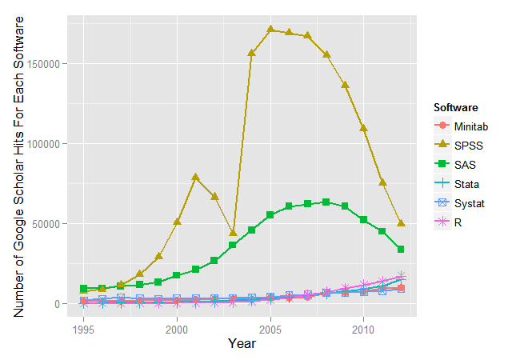
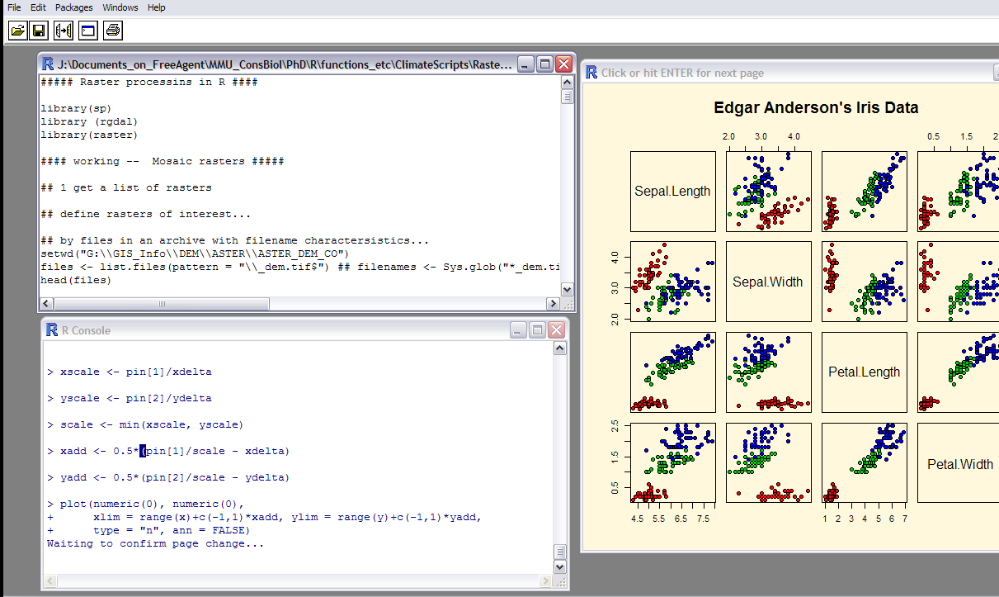
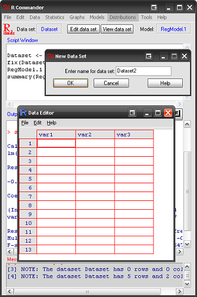

Introduction to R Programming
=======================================================
author: Christian Devenish
date: June 2015
width: 1420
height: 800

# MMU Futures

1.1 Introduction
===================================

- What is R? Why do we use it?

- How do we use R?

- Course structure

- Recommended reading, courses, etc

1.2 Course structure
=================

- First steps ... R as a calculator, variables, scripts
- Introducing RStudio
- R as a calculator.. part II
- Objects, vectors, data types (numeric, character, logical) : swirl
- Importing data
- More on workflow, scripts, organization, home directories
- Graphics
- Flow control (if, for)
- Functions

1.3 What is R?
===========================
- Environment for data analysis and statistical computing
- e.g. Data manipulation, file management, data analysis and automating operations  

  
- Programming language

- *Open source* Software, "free"

- Most popular statistics programme in the world??
***

1.4 Popularity of R
============================

<small>Google Scholar hits for software packages  
http://r4stats.com/articles/popularity</small>

1.5 Why use R?
============================

- Free (different types of free), breaks barriers in access to statistics software
- Huge community of users
- Support (email lists, websites, e.g. Stack Overflow)
- Libraries (special collections of functions)  - 5391
- Sharing code
- More statistical applications than other software
- Integrate with other applications (e.g. GIS, graphics)
- Documentation available

- Reproducibility in research
- Cross platform (Windows, Mac, Linux, etc)

1.6 Contributed packages (collections of functions, code)
===========================

<small>Exponential growth of contributed packages  
http://r4stats.com/articles/popularity/</small>

1.7 How to use R
=======================

Basic "shell"

1.8 How to use R
=================

With a text editor, or IDE

***
Or with a GUI
e.g. R Commander

1.9 Advantages of RStudio (1)
========================================================

IDE - Integrated Development Environment (not a GUI...)

- Facilitates organizing script, objects, help pages, graphics and more...
- Organize scripts in tabs, in projects, with multiple working directories
- Some common tasks are made easy (buttons), e.g. instal packets, import data
- Autocomplete functions, objects, see brief help instantly
- Syntax with colours
- Edit functions (search & replace, find, etc)

1.10 Advantages of RStudio (2)
=============================

- Visualizing data
- Debugging - check errors in your code
- Integration with platforms such as Git and Github (version control) to share projects and collaborate
- Make presentations (like this one)

Other popular editors for R include Tinn-R, notepad++

